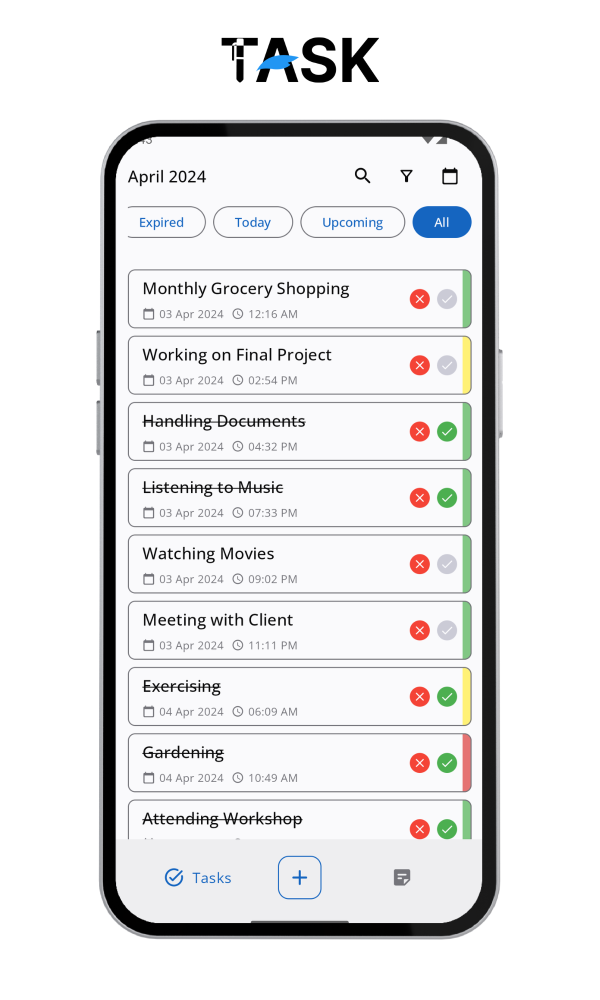
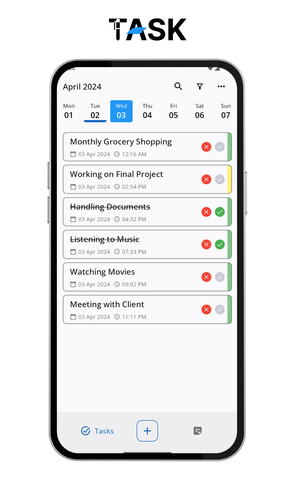
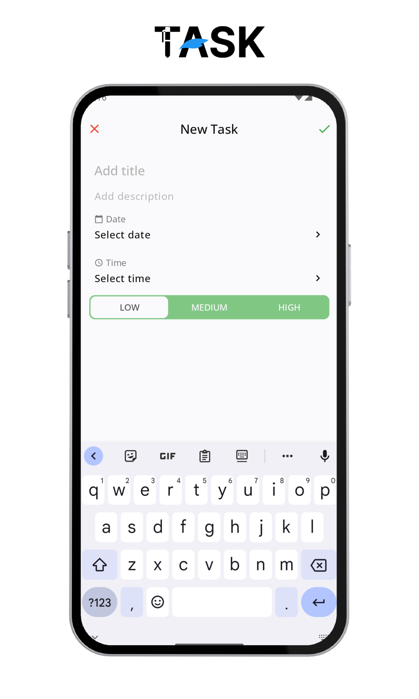
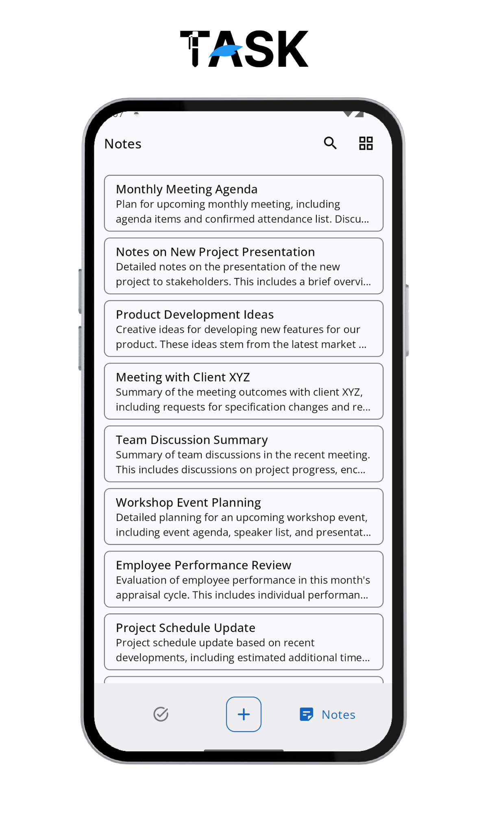
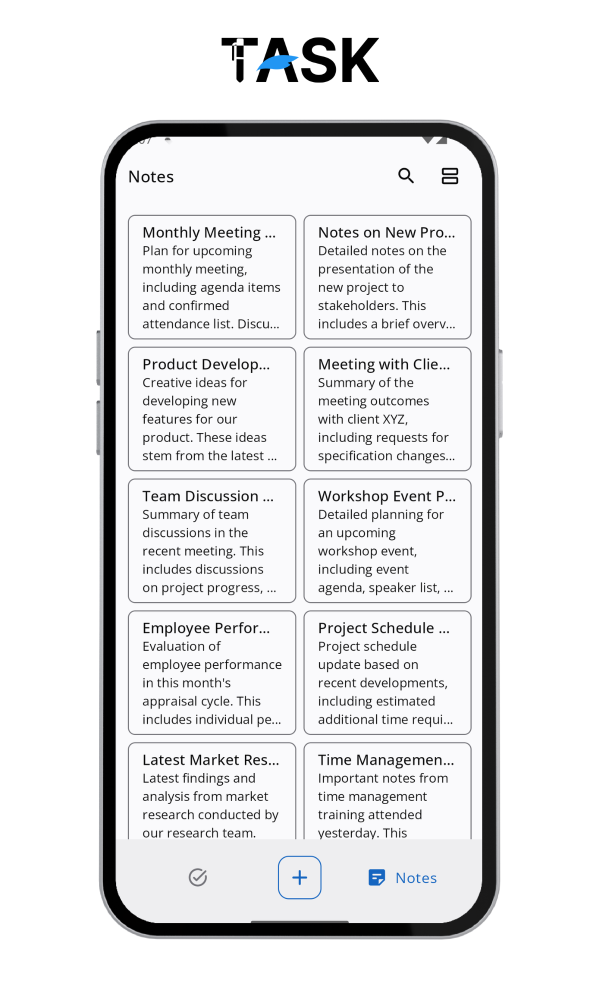
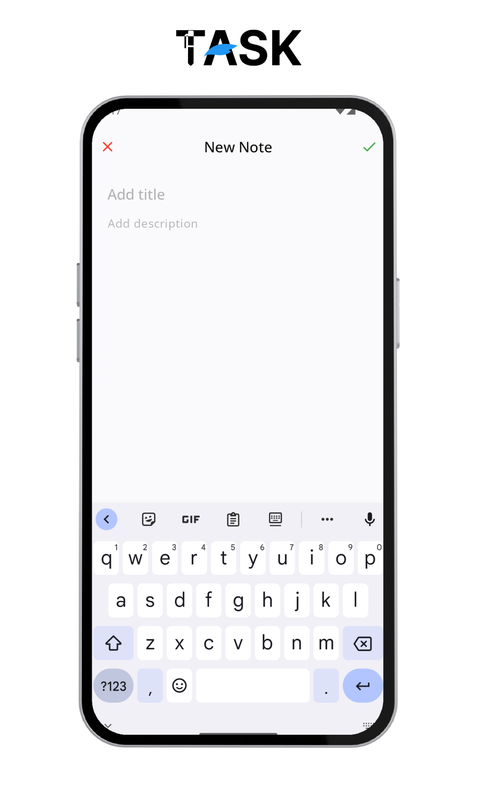

<h1 align="center" style="font-size:28px; line-height:1"><b>RemindTask</b></h1>

  

  RemindTask is a tool designed to help you stay organized and on top of your daily tasks and notes. Whether you're managing work projects, household chores, or personal goals.

## Screenshots
|                      |                      |                      |
|----------------------|----------------------|----------------------|
|  |  |  |
|  |  |  |

## Key Features

- **Task Management.** Easily create, edit, and delete tasks with just a few taps.
- **Priority Setting.** Assign priorities to your tasks to help you focus on what's most important.
- **Notification Alerts.** Receive deadline notifications for each task.
- **Note Management.** Easily create, edit, and delete notes with just a few taps.
- **Intuitive Interface.**  Enjoy a user-friendly interface that makes task management simple and intuitive. Navigate effortlessly between tasks, categories, and settings with smooth transitions and clear visuals.
- **Offline Access.** Enjoy full functionality even when you're offline, allowing you to create, edit, and manage tasks anytime, anywhere, without depending on an internet connection.
  
## Tech Stack

- **Programming Language**: Kotlin
- **User Interface**: Jetpack Compose, Material Design 3
- **Architecture Pattern**: MVVM (Model-View-ViewModel)
- **Dependency Injection**: Dagger Hilt
- **Asynchronous Programming**: Kotlin Coroutines
- **Local Data Storage**: Room Database, Data Store
- **Notification System**: Android NotificationManager
- **IDE**: Android Studio Iguana
- **Dependency Management**: Version Catalog
- **CI/CD**: CircleCi
- **Calendar**: [Calendar](https://github.com/kizitonwose/Calendar) library from [@kizitonwose](https://github.com/kizitonwose)
- **Animation**: [Lottie](https://github.com/airbnb/lottie/blob/master/android-compose.md) for Jetpack Compose

## Getting Started

To get started with Task Reminder Offline, follow these steps:

1. Clone this repository to your local machine using `git clone https://github.com/fatkhurhmn/remind-task.git`
2. Open the project in Android Studio.
3. Build and run the app on an Android device or emulator.

## How to Contribute

Contributions to RemindTask are welcome! To contribute to the project, follow these steps:

1. Fork this repository.
2. Create a new branch for your feature or bug fix: `git checkout -b feature-name`.
3. Make your changes and commit them: `git commit -m 'Add new feature'`.
4. Push to the branch: `git push origin feature-name`.
5. Submit a pull request to the `main` branch of the original repository.
